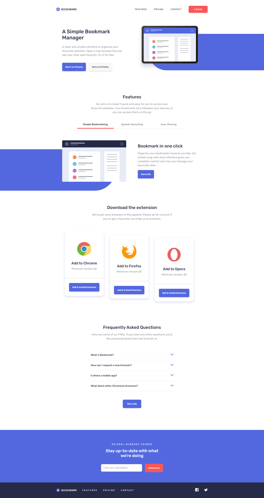

# Frontend Mentor - Bookmark landing page solution

This is a solution to the [Bookmark landing page challenge on Frontend Mentor](https://www.frontendmentor.io/challenges/bookmark-landing-page-5d0b588a9edda32581d29158). Frontend Mentor challenges help you improve your coding skills by building realistic projects. 

## Table of contents

- [Overview](#overview)
  - [The challenge](#the-challenge)
  - [Screenshot](#screenshot)
  - [Links](#links)
  - [Time to complete](#time-to-complete)
- [My process](#my-process)
  - [Built with](#built-with)
  - [What I learned](#what-i-learned)
- [Author](#author)
- [Acknowledgments](#acknowledgments)

## Overview

This is a solution to the [Bookmark landing page challenge on Frontend Mentor](https://www.frontendmentor.io/challenges/bookmark-landing-page-5d0b588a9edda32581d29158).

### The challenge

Users should be able to:

- View the optimal layout for the site depending on their device's screen size
- See hover states for all interactive elements on the page
- Receive an error message when the newsletter form is submitted if:
  - The input field is empty
  - The email address is not formatted correctly

### Screenshot

### Links

- Solution URL: [Github](https://github.com/PawelGargula/bookmark-landing-page-master)
- Live Site URL: [Github pages](https://pawelgargula.github.io/bookmark-landing-page-master/)

### Time to complete
Legend: 1 pomodoro is 30min (25min + short break).

I predict, that i will made it in 32 pomodoros (16 hours).

I made it in 42 pomodoros (21 hours)

## My process

- Read about (how to implement?): Hamburger menu, tabs, accordion
- Implement semantic HTML
- Style (mobile-first)
- Add javascript for hamburger menu, tabs and accordion
- Style for larger devices

### Built with

- Semantic HTML5 markup
- CSS custom properties
- Flexbox
- Mobile-first workflow
- Javascript 

### What I learned
I learned how to implement:
- Hamburger menu
- Tabs
- Accordion

## Author

- Frontend Mentor - [@PawelGargula](https://www.frontendmentor.io/profile/PawelGargula)
- Github - [@PawelGargula](https://github.com/PawelGargula)